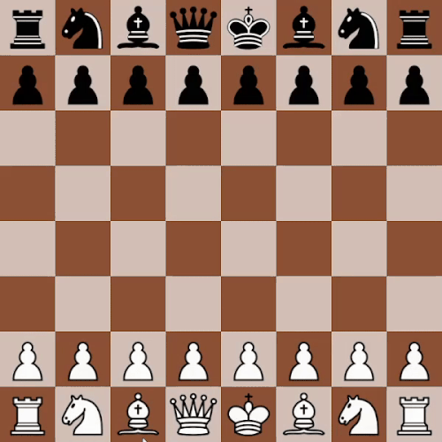
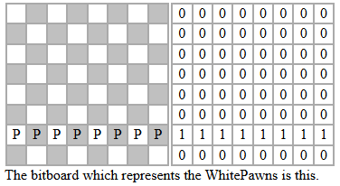
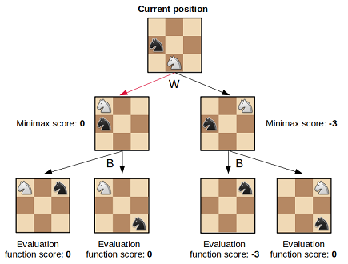

# bitboards-on-top-of-bitboards
### This is a playable chess engine coded from scratch inspired by Sebastian Lague's [Coding Adventure on chess](https://www.youtube.com/watch?v=U4ogK0MIzqk&t=675s)



## Overview

The C++ engine is compiled into a python module using pybind11 and is accessed by ChessGUI.py which renders the chess board with the help of pygame

I chose to wrap the engine with python since working in c++ libraries was too much of a pain, but i ended up having to use pybind (a c++ lib) to connect the scripts anyways...

## Board Representation

To represent the board position we utilize bitboards. A bitboard is a 64-bit integer that stores the positions of each piece (1 means the square is occupied and 0 means its empty). Due to the fact that a chess board contains 64 squares we can describe the board position using 12 of these bitboards (1 for each unique piece type). Effectively describing the board position using 12 large numbers.

This turns out to be a very efficient way of representing the board since we can perform various of bitwise operations to move pieces around with minimal computational overhead



## Engine Search

The Engine employs an algorithm called minimax (with alpha beta pruning) to calculate the best posible move. 

- The algorithm simulates all possible moves up to a certain depth
- It then calculates the evaluation of all board positions
- Finally it finds the best move for a side assuming black will always play a move that minimizes the evaluation and white plays a move that maximizes
- Alpha Beta pruning lets us significantly reduce the number of calculations by letting us skip positions, once we know a side already has a better move to play.



## Instructions

To install python requirements run this in a terminal
```bash
pip install -r requirements.txt
```
Pybind11 is inside the repo so no need to do anything.

To build the program run: (CMake must be installed)
```bash
mkdir build
cd build
cmake ..
cmake --build . --config Release
```

This will create a .pyd inside build/Release/. To finally run the program make sure the correct directory to the .pyd is linked inside ChessGUI.py and run the script.


#

P.S. No en passant